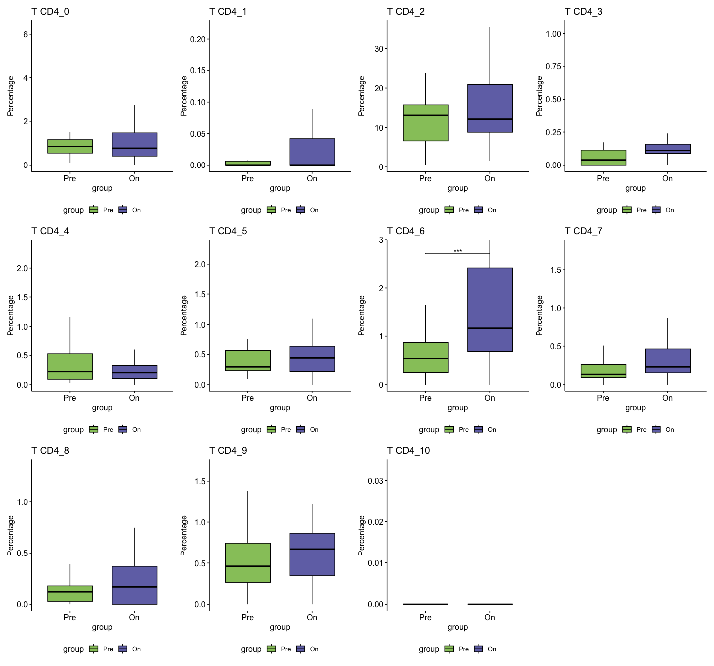
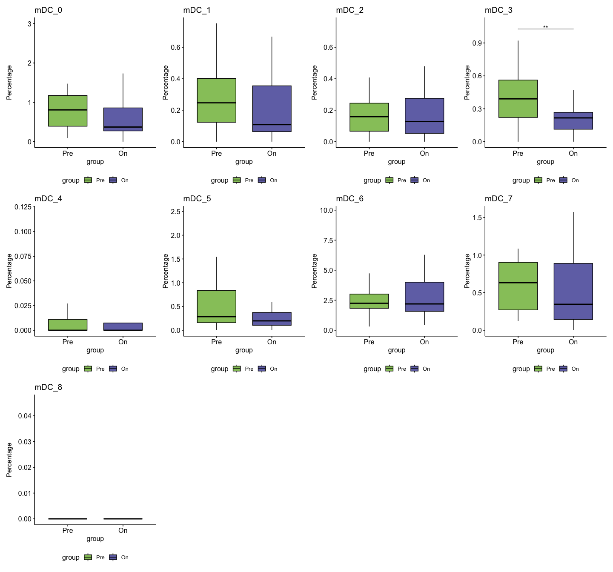
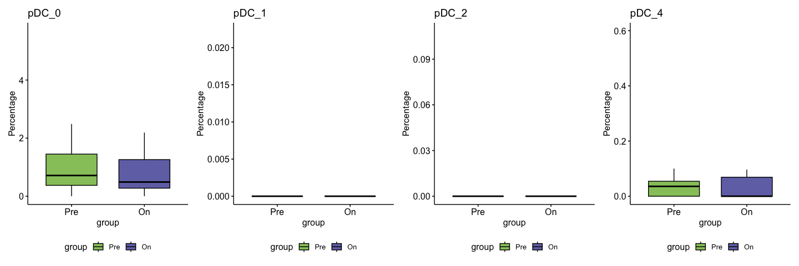
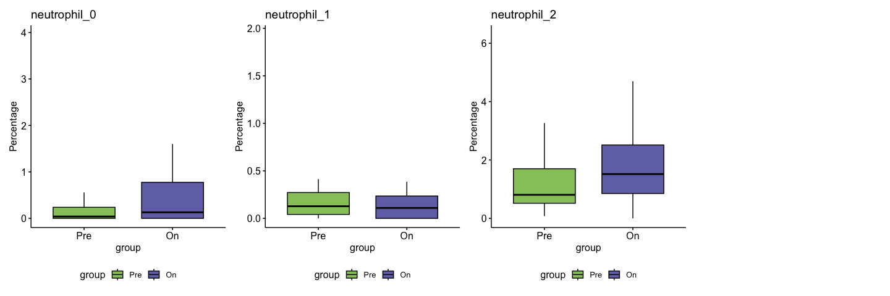

# Signature data Franken


-   [Apply signatures](#apply-signatures)
-   [Load](#load)
-   [Pro/anti vaccine](#proanti-vaccine)
    -   [All on top](#all-on-top)
-   [Subtypes](#subtypes)
    -   [P-values](#p-values)
    -   [Prep data](#prep-data)
    -   [Figures subfigures](#figures-subfigures)

``` r
dir <- "/Users/rcslieker/Documents/ONCO/002_Projects/002_CosMx_signatures/"
knitr::opts_knit$set(root.dir = dir)
setwd(dir)
```

### Apply signatures

``` r
load("../000_Data/002_Public_Datasets/Franken_Immunity/Data/Seurat_Franken.RData")
rnms_franken <- rownames(se)
save(rnms_franken, file="../000_Data/002_Public_Datasets/Franken_Immunity/Data/Rownames_Franken.RData")
```

``` r
library(ggplot2)
library(magrittr)
library(Seurat)
library(ggplot2)
```

## Load

``` r
load("/Users/rcslieker/Documents/ONCO/002_Projects/000_Data/002_Public_Datasets/Franken_Immunity/new_models.rda")
CosMx <- readRDS("/Users/rcslieker/Documents/ONCO/002_Projects/001_CosMxData/002_Data/smi0042_seurat_obj_23-11-27.rds")

se <- SeuratObject:::subset.Seurat(se, features = rownames(CosMx))
save(se, file="./002_Data/FrankenSubset.RData")
```

``` r
load("./002_Data/Franken_Applied.RData")
meta <- rio::import("/Users/rcslieker/Documents/ONCO/002_Projects/000_Data/002_Public_Datasets/Franken_Immunity/HNSCC_metadata.csv")
```

    Warning in (function (input = "", file = NULL, text = NULL, cmd = NULL, :
    Detected 4 column names but the data has 5 columns (i.e. invalid file). Added 1
    extra default column name for the first column which is guessed to be row names
    or an index. Use setnames() afterwards if this guess is not correct, or fix the
    file write command that created the file to create a valid file.

``` r
meta$Treatment <- "Durvalumab"
```

``` r
metax <- meta[match(rownames(Franken_applied), meta$V1),]

Franken_applied$Treatment <- metax$Treatment
Franken_applied$SampleType <- metax$SampleType

fa <- Franken_applied[,c("Patient","SampleType","Treatment")] %>% unique()

table(fa$SampleType, fa$Treatment)
```

                   
                    Durvalumab
      Healthy               16
      LN                    17
      On-treatment          20
      Pre-treatment         20

``` r
Franken_applied$mainClass <- gsub("plasmablast","plasma cell",Franken_applied$mainClass)
Franken_applied$subClass <- gsub("plasmablast","plasma cell",Franken_applied$subClass)
```

``` r
table(Franken_applied$mainClass)
```


              a           b      B-cell           c           d           e 
           5908       13920       27712        8062         910        5379 
    endothelial           f  fibroblast  macrophage        mast         mDC 
          11012         336       34417       13014         885       10847 
     neutrophil         pDC plasma cell       T CD4       T CD8        Treg 
           5142        2594        7702       86306       33708        5859 
     Unassigned 
          35438 

``` r
Franken_applied <- Franken_applied[!Franken_applied$mainClass %in% "Unassigned",]
```

``` r
#Main
freqs_main <- table(Franken_applied$mainClass, Franken_applied$SampleType,  Franken_applied$Patient) %>% reshape2::melt()
freqs_sub <- table(Franken_applied$subClass, Franken_applied$SampleType,  Franken_applied$Patient) %>% reshape2::melt()

#Add id 
freqs_main$newID <- paste0(freqs_main$Var3,"_",freqs_main$Var2)
freqs_sub$newID <- paste0(freqs_sub$Var3,"_",freqs_sub$Var2)

#All
freqs_main_all <- table(Franken_applied$SampleType, Franken_applied$Patient) %>% reshape2::melt()
freqs_sub_all <- table(Franken_applied$SampleType, Franken_applied$Patient) %>% reshape2::melt()

#Add id 
freqs_main_all$newID <- paste0(freqs_main_all$Var2,"_",freqs_main_all$Var1)
freqs_sub_all$newID <- paste0(freqs_sub_all$Var2,"_",freqs_sub_all$Var1)

## Add total
freqs_main$Total <- freqs_main_all[match(freqs_main$newID, freqs_main_all$newID),"value"]
freqs_sub$Total <- freqs_sub_all[match(freqs_sub$newID, freqs_sub_all$newID),"value"]

freqs_main$Percentage <- as.numeric((freqs_main$value / freqs_main$Total)*100)
freqs_sub$Percentage <- as.numeric((freqs_sub$value / freqs_sub$Total)*100)

#Add treatment group
freqs_main$TreatmentGroup <- Franken_applied[match(freqs_main$Var2, Franken_applied$samples),"treatment.group"]
freqs_sub$TreatmentGroup <- Franken_applied[match(freqs_sub$Var2, Franken_applied$samples),"treatment.group"]

freqs_main <- freqs_main[!is.nan(freqs_main$Percentage),]
freqs_sub <- freqs_sub[!is.nan(freqs_sub$Percentage),]

freqs_main$Treatment <- meta[match(freqs_main$Var3, meta$Patient),"Treatment"]
freqs_sub$Treatment <- meta[match(freqs_sub$Var3, meta$Patient),"Treatment"]
```

## Pro/anti vaccine

``` r
cts.sns <- rio::import("./002_Data/Abdulrahman_SNS_CellTypes.xlsx")
Franken_applied$ID <- paste0(Franken_applied$Patient, "_", Franken_applied$SampleType)
Franken_applied.sub <- Franken_applied[Franken_applied$subClass %in% cts.sns$CellType,]

Franken_applied.sub$Class <- cts.sns[match(Franken_applied.sub$subClass, cts.sns$CellType),1]

freqs_sns_all <- table(Franken_applied.sub$Class, Franken_applied.sub$ID) %>% t()
freqs_sns_all <- as.data.frame.matrix(freqs_sns_all)
freqs_sns_all$ID <- rownames(freqs_sns_all)
freqs_sns_all <- data.frame(freqs_sns_all, Franken_applied[match(freqs_sns_all$ID, Franken_applied$ID),c("Treatment","SampleType")])

freqs_sns_all$ratio <- freqs_sns_all$Supportive / freqs_sns_all$Non.supportive

all.f <- table(Franken_applied$ID)
freqs_sns_all$Total <- all.f[match(freqs_sns_all$ID, names(all.f))]

freqs_sns_all$Non.supportive.p <- (freqs_sns_all$Non.supportive/freqs_sns_all$Total)*100
freqs_sns_all$Supportive.p <- (freqs_sns_all$Supportive/freqs_sns_all$Total)*100
```

``` r
library(ggpubr)
freqs_sns_sub <- freqs_sns_all[freqs_sns_all$SampleType %in% c("Pre-treatment","On-treatment"),]

freqs_sns_sub$timepoint <- gsub("-treatment","",freqs_sns_sub$SampleType)
freqs_sns_sub$timepoint <- factor(freqs_sns_sub$timepoint, levels = c("Pre","On"))

freqs_sns_sub$ID <- reshape2::colsplit(freqs_sns_sub$ID,"_",LETTERS[1:2])[,1]
freqs_sns_sub <- freqs_sns_sub[rev(order(freqs_sns_sub$timepoint)),]
```

#### new plot type (slopes)

``` r
library(patchwork)

pdf("./004_PaperFigures/Franken_2Ddensity.pdf", width=5, height=4)
ggplot(freqs_sns_sub, aes(x=Non.supportive.p, y=Supportive.p))+
  geom_point(aes(col=timepoint))+
  geom_abline(intercept = 0, slope=1, col="gray")+
  scale_colour_manual(values = c("#96C66A","#7172B4"))+
  scale_fill_manual(values = c("#96C66A","#7172B4"))+
  stat_density_2d(geom = "polygon", aes(alpha = after_stat(level), fill = timepoint))+
  ylim(0,50)+
  xlim(0,50)+
  xlab("Percentage non-supportive cells")+
  ylab("Percentage supportive cells")
dev.off()
```

    quartz_off_screen 
                    2 

### All on top

``` r
cts.sns <- rio::import("./002_Data/Abdulrahman_SNS_CellTypes.xlsx")
Franken_applied.sub <- Franken_applied[Franken_applied$subClass %in% cts.sns$CellType,]

Franken_applied.sub$Class <- cts.sns[match(Franken_applied.sub$subClass, cts.sns$CellType),1]

freqs_sns_ct <- lapply(unique(Franken_applied.sub$mainClass_fromSub), function(ct){
  cat(ct)
  freqs_sns_all <- table(Franken_applied.sub[Franken_applied.sub$mainClass_fromSub %in% ct,]$Class, 
                         Franken_applied.sub[Franken_applied.sub$mainClass_fromSub %in% ct,]$ID) %>% t()
  if(ncol(freqs_sns_all) == 1) return()
  freqs_sns_all <- as.data.frame.matrix(freqs_sns_all)
  freqs_sns_all$ID <- rownames(freqs_sns_all)
  freqs_sns_all <- data.frame(freqs_sns_all, SampleType = Franken_applied[match(freqs_sns_all$ID, Franken_applied$ID),"SampleType"])
  freqs_sns_all <- freqs_sns_all[freqs_sns_all$SampleType %in% c("Pre-treatment","On-treatment"),]
  freqs_sns_all$timepoint <- factor(freqs_sns_all$SampleType, levels=c("Pre-treatment","On-treatment"))
  freqs_sns_all$ratio <- freqs_sns_all$Supportive / freqs_sns_all$Non.supportive
  freqs_sns_all$ct <- ct
  freqs_sns_all
}) %>% do.call(what=rbind)
```

    TregmacrophageT CD8fibroblastmDCendothelialmastT CD4pDC

## Subtypes

### P-values

``` r
pvals.sub <- lapply(unique(as.character(freqs_sub$Var1)), function(i){
  cat(i)
  sd <- freqs_sub[freqs_sub$Var1 %in% i,]
  sd <- sd[sd$Var2 %in% c("Pre-treatment","On-treatment"),]
  sd <- sd[order(sd$Var3),]
  sd$Groups <- paste0(sd$Var2,"_", sd$Treatment)
  mx <- pairwise.wilcox.test(sd$Percentage, g = sd$Groups, p.adjust.method = "none", paired=TRUE)
  mx <- reshape2::melt(mx$p.value)
  mx$CellType <- i
  mx <- mx[!is.na(mx$value),]
  mx
})%>% do.call(what = rbind)
```

    a_0a_1a_10a_2a_3a_4a_5a_6a_7a_8a_9b_0b_1b_10b_11b_12b_13b_2b_3b_4b_5b_6b_7b_8b_9B-cell_0B-cell_1B-cell_2B-cell_3B-cell_4B-cell_5c_0c_1c_10c_11c_12c_2c_3c_4c_5c_6c_7c_8c_9d_0d_1d_10d_2d_3d_4d_6d_8d_9e_0e_1e_10e_11e_12e_2e_3e_4e_5e_6e_7e_8e_9endothelial_0endothelial_1endothelial_10endothelial_2endothelial_3endothelial_4endothelial_6endothelial_7endothelial_8endothelial_9f_0f_2f_4f_5f_6f_7f_8fibroblast_0fibroblast_1fibroblast_2fibroblast_3fibroblast_4fibroblast_5fibroblast_6fibroblast_7fibroblast_8fibroblast_9macrophage_0macrophage_1macrophage_2macrophage_3macrophage_4macrophage_5macrophage_6macrophage_7macrophage_8macrophage_9mast_0mast_1mast_2mast_3mast_4mast_5mast_7mDC_0mDC_1mDC_2mDC_3mDC_4mDC_5mDC_6mDC_7mDC_8neutrophil_0neutrophil_1neutrophil_2pDC_0pDC_1pDC_2pDC_4plasma cell_0plasma cell_1plasma cell_2plasma cell_3plasma cell_4plasma cell_5plasma cell_6plasma cell_7plasma cell_8T CD4_0T CD4_1T CD4_10T CD4_2T CD4_3T CD4_4T CD4_5T CD4_6T CD4_7T CD4_8T CD4_9T CD8_0T CD8_1T CD8_2T CD8_3T CD8_4T CD8_5T CD8_6T CD8_7Treg_0Treg_1Treg_2Treg_3Treg_4Treg_5Treg_6Treg_7Unassigned

``` r
pvals.sub <- pvals.sub[!pvals.sub$CellType %in% "unknown",]
```

### Prep data

``` r
freqs_sub2 <- freqs_sub[grep("treatment", freqs_sub$Var2),]
freqs_sub2$Var2 <- factor(freqs_sub2$Var2,levels=c("Pre-treatment","On-treatment"))
pvals.sub.subset <- pvals.sub[grep("Pre",pvals.sub$Var1),]
pvals.sub.subset <- pvals.sub.subset[grep("On",pvals.sub.subset$Var2),]

keep <- which(reshape2::colsplit(pvals.sub.subset$Var1,"_", LETTERS[1:2])[,2]==
reshape2::colsplit(pvals.sub.subset$Var2,"_", LETTERS[1:2])[,2])
pvals.sub.subset <- pvals.sub.subset[keep,]
pvals.sub.subset$Treatment <- reshape2::colsplit(pvals.sub.subset$Var1,"_", LETTERS[1:2])[,2]
  
freqs_sub2$newID <- paste0(freqs_sub2$Var1, "_", freqs_sub2$Treatment)
pvals.sub.subset$newID <- paste0(pvals.sub.subset$CellType, "_", pvals.sub.subset$Treatment)


freqs_sub2$P <- pvals.sub.subset[match(freqs_sub2$newID, pvals.sub.subset$newID),"value"]
freqs_sub2$Sign <- ifelse(freqs_sub2$P <= 0.05, "*","")


mx <- by(freqs_sub2$Percentage, freqs_sub2$Var1, function(i){quantile(i, probs=0.90)}) %>% as.list() %>% do.call(what=c)

freqs_sub2$y <- mx[match(freqs_sub2$Var1, names(mx))]

rio::export(pvals.sub.subset, file="./003_Figures/Franken_significant_subsets.xlsx")
```

### Figures subfigures

``` r
library(ggpubr)
library(rstatix)
```


    Attaching package: 'rstatix'

    The following object is masked from 'package:stats':

        filter

``` r
library(patchwork)
#i="T CD8_4"
getSubPlot <- function(i){
  fma <- freqs_sub2[freqs_sub2$Var1 %in% i,]
  fma$group <- gsub("-treatment","",fma$Var2)
  fma$group <- factor(fma$group, levels=c("Pre","On"))
  # Create a box plot
  bxp <- ggboxplot(outlier.shape=NA,
    fma, x = "group", y = "Percentage",
    fill = "group", palette = c("#96C66A", "#7172B4")
    )#+scale_x_discrete(labels=c("D","D+T"))
  
  
  ps2 <- pvals.sub.subset[pvals.sub.subset$CellType %in% i,]
  ps2 <- ps2[!ps2$CellType %in% "Unassigned",]

 
  bp <- boxplot(fma$Percentage, plot=FALSE) # box plot is a simple way to identify outliers
  if(length(bp$out) > 0){outlier <- which(fma$Percentage %in% bp$out) # get the position of those outliers in your data
    
   maxv <- by(fma[-outlier,]$Percentage, fma[-outlier,]$group, function(i){quantile(i, probs=0.95)}) %>% as.list() %>% do.call(what=c) %>% max(na.rm=T)
  }else{
    maxv <- by(fma$Percentage, fma$group, function(i){quantile(i, probs=0.95)}) %>% as.list() %>% do.call(what=c) %>% max(na.rm=T)
  }
    
    
  ps2 <- add_significance(ps2, p.col = "value")
  ps2 <- ps2[ps2$value <= 0.05,]
  
  seqx <- .2+(0.1*c(1,3,5,7,9,11))

  if(nrow(ps2) > 0) ps2$y.position <- maxv+seqx[1:nrow(ps2)]

  if(nrow(ps2) > 0){
      maxx <- max(ps2$y.position)*1.05
  }else{
    maxx <- maxv
  }
  
  if(nrow(ps2) > 0){
    ps2$Var1 <- reshape2::colsplit(ps2$Var1,"_", LETTERS[1:2])[,1] %>% gsub(pattern = "-treatment", replacement = "")
    ps2$Var2 <- reshape2::colsplit(ps2$Var2,"_", LETTERS[1:2])[,1] %>% gsub(pattern = "-treatment", replacement = "")
    
    
    colnames(ps2)[1:2] <- c("group1","group2")
    
    ps2$x <- 1.5
    ps2$xmin <- 1
    ps2$xmax <- 2
  

    bxp <- bxp + coord_cartesian(ylim = c(0, maxx)) +stat_pvalue_manual(
      ps2,  label = "value.signif", tip.length = 0)+
      theme(legend.position = "bottom")+
      ggtitle(i)
    return(bxp)
  }else{
    bxp <- bxp+
      theme(legend.position = "bottom")+
      ggtitle(i)
    
    return(bxp)
  }
 
  
  
}


getPlot <-function(ct.in){
  cts <- freqs_sub2$Var1[grep(paste0(ct.in,"_"), freqs_sub2$Var1)] %>% as.character() %>% unique()
  
  cts.o <- paste0(ct.in,"_", 0:20)
  cts.o <- cts.o[cts.o %in% cts]
  
  lapply(cts.o, getSubPlot) %>% wrap_plots(ncol=4)
}
```

``` r
getPlot(ct.in = "T CD4")
```



``` r
pdf("./004_PaperFigures/Franken_TCD4.pdf", width=15, height=14)
getPlot("T CD4")
dev.off()
```

    quartz_off_screen 
                    2 

``` r
getPlot("T CD8")
```


``` r
pdf("./004_PaperFigures/Franken_TCD8.pdf", width=15, height=10)
getPlot("T CD8")
dev.off()
```

    quartz_off_screen 
                    2 

``` r
getPlot("Treg")
```


``` r
pdf("./004_PaperFigures/Franken_Treg.pdf", width=15, height=9)
getPlot("Treg")
dev.off()
```

    quartz_off_screen 
                    2 

``` r
getPlot("B-cell")
```


``` r
pdf("./004_PaperFigures/Franken_Bcell.pdf", width=15, height=9)
getPlot("B-cell")
dev.off()
```

    quartz_off_screen 
                    2 

``` r
getPlot("endothelial")
```


``` r
pdf("./004_PaperFigures/Franken_endothelial.pdf", width=15, height=13)
getPlot("endothelial")
dev.off()
```

    quartz_off_screen 
                    2 

``` r
getPlot("fibroblast")
```


``` r
pdf("./004_PaperFigures/Franken_fibroblast.pdf", width=15, height=13)
getPlot("fibroblast")
dev.off()
```

    quartz_off_screen 
                    2 

``` r
getPlot("macrophage")
```


``` r
pdf("./004_PaperFigures/Franken_macrophage.pdf", width=15, height=13)
getPlot(ct.in = "macrophage")
dev.off()
```

    quartz_off_screen 
                    2 

``` r
getPlot("mast")
```


``` r
pdf("./004_PaperFigures/Franken_mast.pdf", width=15, height=9)
getPlot("mast")
dev.off()
```

    quartz_off_screen 
                    2 

``` r
getPlot("mDC")
```



``` r
pdf("./004_PaperFigures/Franken_mDC.pdf", width=15, height=14)
getPlot("mDC")
dev.off()
```

    quartz_off_screen 
                    2 

``` r
getPlot("pDC")
```



``` r
pdf("./004_PaperFigures/Franken_pDC.pdf", width=15, height=5)
getPlot("pDC")
dev.off()
```

    quartz_off_screen 
                    2 

``` r
getPlot("plasma cell")
```


``` r
pdf("./004_PaperFigures/Franken_plasmacell.pdf", width=15, height=13)
getPlot("plasma cell")
dev.off()
```

    quartz_off_screen 
                    2 

``` r
getPlot("neutrophil")
```



``` r
pdf("./004_PaperFigures/Franken_neutrophil.pdf", width=15, height=5)
getPlot("neutrophil")
dev.off()
```

    quartz_off_screen 
                    2 
