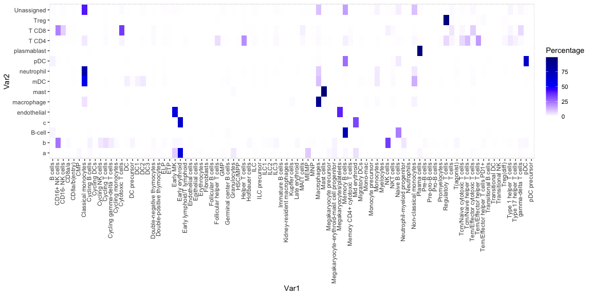
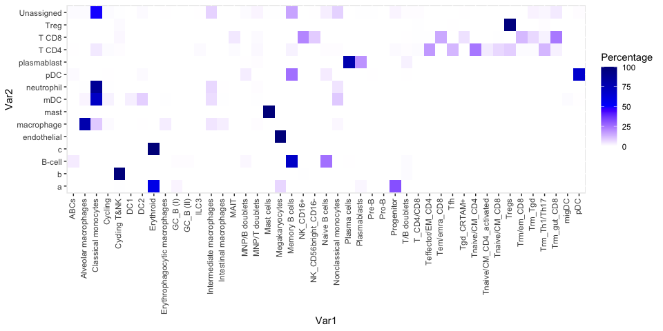
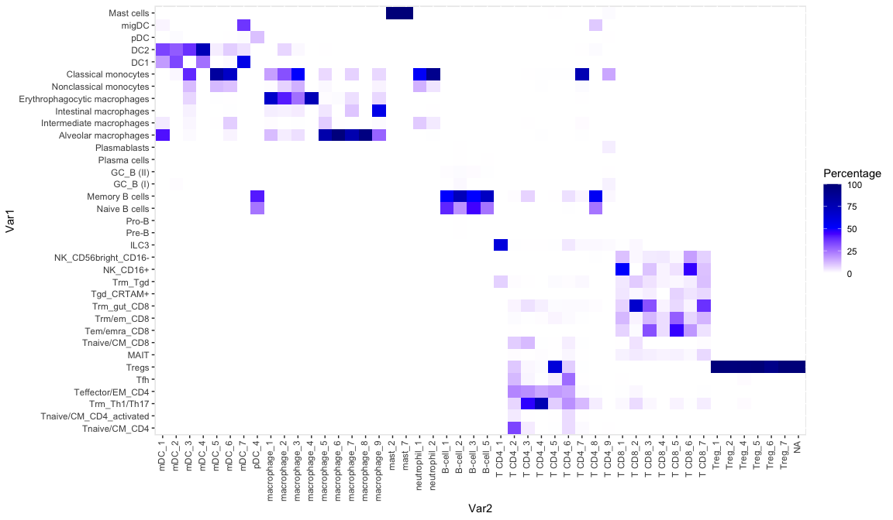

# Conde


-   [Packages](#packages)
-   [](#section)

``` r
dir <- "/Users/rcslieker/Documents/ONCO/002_Projects/002_CosMx_signatures"
knitr::opts_knit$set(root.dir = dir)
knitr::opts_chunk$set(tidy.opts = list(width.cutoff = 60), tidy = TRUE)
setwd(dir)
```

## Packages

``` r
library(SingleR)
library(Seurat)
library(patchwork)
library(magrittr)
library(ggplot2)
```

# 

``` r
load("./002_Data/Conde_Immune_Applied.RData")
```

``` r
all <- table(Conde_immune_applied$Predicted_labels_CellTypist,
    Conde_immune_applied$mainClass) %>%
    as.data.frame()
total <- table(Conde_immune_applied$mainClass) %>%
    as.data.frame()

all$Total <- total[match(all$Var2, total$Var1), 2]
all$Percentage <- (all$Freq/all$Total) * 100
```

``` r
ggplot(all, aes(x = Var1, y = Var2, fill = Percentage)) + geom_tile() +
    theme(axis.text.x = element_text(angle = 90, vjust = 0.3,
        hjust = 1)) + scale_fill_gradientn(colours = c("white",
    "blue", "darkblue"))
```



``` r
all <- table(Conde_immune_applied$Manually_curated_celltype,
    Conde_immune_applied$mainClass) %>%
    as.data.frame()
total <- table(Conde_immune_applied$mainClass) %>%
    as.data.frame()

all$Total <- total[match(all$Var2, total$Var1), 2]
all$Percentage <- (all$Freq/all$Total) * 100
```

``` r
ggplot(all, aes(x = Var1, y = Var2, fill = Percentage)) + geom_tile() +
    theme(axis.text.x = element_text(angle = 90, vjust = 0.3,
        hjust = 1)) + scale_fill_gradientn(colours = c("white",
    "blue", "darkblue"))
```



``` r
all <- table(Conde_immune_applied$Manually_curated_celltype,
    Conde_immune_applied$subClass) %>%
    as.data.frame()
total <- table(Conde_immune_applied$subClass) %>%
    as.data.frame()

all$Total <- total[match(all$Var2, total$Var1), 2]
all$Percentage <- (all$Freq/all$Total) * 100

head(all)
```

                      Var1 Var2 Freq Total Percentage
    1                 ABCs  a_0    0   169          0
    2 Alveolar macrophages  a_0    0   169          0
    3  Classical monocytes  a_0    0   169          0
    4              Cycling  a_0    0   169          0
    5         Cycling T&NK  a_0    0   169          0
    6                  DC1  a_0    0   169          0

``` r
levels5 <- c(
  "Tnaive/CM_CD4",
  "Tnaive/CM_CD4_activated",
  "Trm_Th1/Th17",
  "Teffector/EM_CD4",
  "Tfh",
  "Tregs",
  "MAIT",
  "Tnaive/CM_CD8",
  "Tem/emra_CD8",
  "Trm/em_CD8",
  "Trm_gut_CD8",
  "Tgd_CRTAM+",
  "Trm_Tgd",
  "NK_CD16+",
  "NK_CD56bright_CD16-",
  "ILC3",
  
  "Pre-B",
  "Pro-B",
  "Naive B cells",
  "Memory B cells",
  "Age-associated B cells",
  "GC_B (I)",
  "GC_B (II)",
  "Plasma cells",
  "Plasmablasts",
  
  "Alveolar macrophages",
  "Intermediate macrophages",
  "Intestinal macrophages",
  "Erythrophagocytic macrophages",
  "Nonclassical monocytes",
  "Classical monocytes",
  "DC1",
  "DC2",
  "pDC",
  "migDC",
  "Mast cells"
)

all <- all[all$Var1 %in% levels5,]
all$Var1 <- factor(all$Var1, levels=levels5)
```

``` r
levels <- c("mDC", "pDC", "macrophage", "mast", "neutrophil",
    "B-cell", "plasma cell", "T CD4", "T CD8", "Treg")
lvl <- paste0(rep(levels, each = 20), "_", 1:20)

all$Main <- reshape2::colsplit(all$Var2, "_", LETTERS[1:2])[,
    1]
all <- all[all$Main %in% levels, ]

lvl <- lvl[lvl %in% all$Var2]

all$Var2 <- factor(all$Var2, levels = lvl)
```

``` r
ggplot(all, aes(x = Var2, y = Var1, fill = Percentage)) + geom_tile() +
    theme(axis.text.x = element_text(angle = 90, vjust = 0.3,
        hjust = 1)) + scale_fill_gradientn(colours = c("white",
    "blue", "darkblue"))
```



``` r
pdf("./003_Figures/Conde_Overlap_SubTypes.pdf", width = 12, height = 7)
ggplot(all, aes(x = Var2, y = Var1, fill = Percentage)) + geom_tile() +
    theme(axis.text.x = element_text(angle = 90, vjust = 0.3,
        hjust = 1)) + scale_fill_gradientn(colours = c("white",
    "blue", "darkblue")) + xlab("Cell types current study") +
    ylab("Cell types Conde et al.")
dev.off()
```

    quartz_off_screen 
                    2 
