# Bassez data


-   [Bassez](#bassez)
    -   [Apply signatures](#apply-signatures)
-   [Subset data](#subset-data)
-   [Rename](#rename)
-   [Check](#check)
-   [Change levels](#change-levels)
-   [Frequency across conditions](#frequency-across-conditions)
-   [Add meta info](#add-meta-info)
-   [Add PID](#add-pid)
-   [Main classes](#main-classes)
    -   [Plots](#plots)
-   [Subtypes](#subtypes)

``` r
dir <- "/Users/rcslieker/Documents/ONCO/002_Projects/002_CosMx_signatures/"
knitr::opts_knit$set(root.dir = dir)
setwd(dir)
```

## Bassez

Downloaded from: https://lambrechtslab.sites.vib.be/en/data-access

### Apply signatures

``` r
library(ggplot2)
library(magrittr)
library(Seurat)
library(ggplot2)
library(ggpubr)
library(rstatix)

source("./001_Scripts/Utils.R")
```

## Subset data

``` r
load("../000_Data/002_Public_Datasets/Bassez_Breast/Cohort1.RData")
```

## Rename

``` r
load("./002_Data/Bassez_Immune_Applied.RData")
Bassez_applied$mainClass <- gsub("plasmablast","plasma cell",Bassez_applied$mainClass)
Bassez_applied$subClass <- gsub("plasmablast","plasma cell",Bassez_applied$subClass)
```

## Check

``` r
t.sub <- table(Bassez_applied$cellType, Bassez_applied$mainClass)  %>% as.data.frame()
t.all <- table(Bassez_applied$mainClass) %>% as.data.frame()
t.sub$Total <- t.all[match(t.sub$Var2, t.all$Var1),2]

t.sub$Percentage <- (t.sub$Freq / t.sub$Total)*100
```

## Change levels

``` r
t.sub <- t.sub[!t.sub$Var2 %in% "Unassigned",]
lvl <- c("B-cell","plasma cell","T CD4","T CD8","Treg","macrophage","neutrophil","mDC","pDC","mast", "fibroblast","endothelial","a","b","c","d","e","f")
t.sub$Var2 <- factor(t.sub$Var2, levels=lvl)
t.sub$Var1 <- factor(t.sub$Var1, levels=rev(c("B_cell","T_cell","Myeloid_cell","pDC","Mast_cell",
                                          "Fibroblast","Endothelial_cell","Cancer_cell")))
```

``` r
ggplot(t.sub, aes(x=Var2, y=Var1, fill=Percentage))+
  geom_tile()+
  theme(panel.background = element_rect(fill = "white"),
        axis.text.x = element_text(angle=90, vjust=0.3, hjust=1))+
  scale_fill_gradientn(colours = c("white","blue","black"))
```

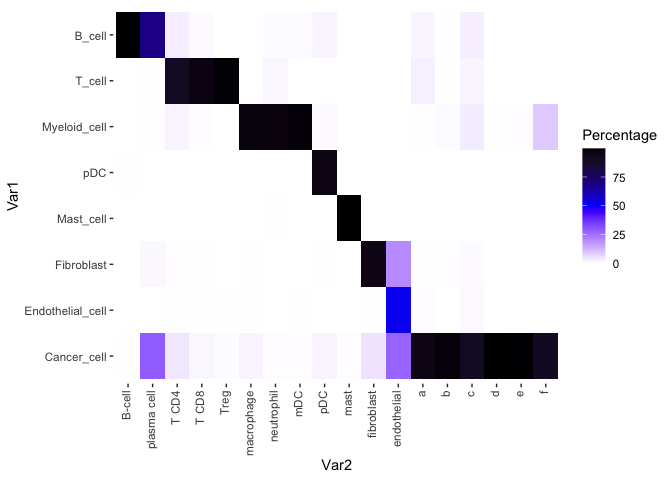

## Frequency across conditions

``` r
Bassez_applied$Tumour_ID <- paste0(Bassez_applied$patient_id, "_", Bassez_applied$timepoint)

freqs_main_all <- table(Bassez_applied$mainClass, Bassez_applied$Tumour_ID) %>% reshape2::melt()
freqs_main_overall <- table(Bassez_applied$Tumour_ID) %>% reshape2::melt()

freqs_sub_all <- table(Bassez_applied$subClass, Bassez_applied$Tumour_ID) %>% reshape2::melt()
freqs_sub_overall <- table(Bassez_applied$Tumour_ID) %>% reshape2::melt()
```

## Add meta info

``` r
freqs_main_all$Total <- freqs_main_overall[match(freqs_main_all$Var2, freqs_main_overall$Var1),"value"]
freqs_sub_all$Total <- freqs_sub_overall[match(freqs_sub_all$Var2, freqs_sub_overall$Var1),"value"]


freqs_main_all <- data.frame(freqs_main_all, Bassez_applied[match(freqs_main_all$Var2, Bassez_applied$Tumour_ID),c("BC_type","timepoint")])
freqs_sub_all <- data.frame(freqs_sub_all, Bassez_applied[match(freqs_sub_all$Var2, Bassez_applied$Tumour_ID),c("BC_type","timepoint")])
freqs_main_all$Percentage <- (freqs_main_all$value / freqs_main_all$Total)*100
freqs_sub_all$Percentage <- (freqs_sub_all$value / freqs_sub_all$Total)*100
freqs_main_all$timepoint <- factor(freqs_main_all$timepoint, levels=c("Pre","On"))
freqs_sub_all$timepoint <- factor(freqs_sub_all$timepoint, levels=c("Pre","On"))
```

## Add PID

``` r
freqs_main_all$patient_id <- Bassez_applied[match(freqs_main_all$Var2, Bassez_applied$Tumour_ID),"patient_id"]
freqs_sub_all$patient_id <- Bassez_applied[match(freqs_sub_all$Var2, Bassez_applied$Tumour_ID),"patient_id"]
```

## Main classes

### Plots

``` r
lvl <- levels(freqs_main_all$Var1)
lvl <- lvl[!lvl %in% "Unassigned"]

pvals.main <- lapply(lvl, function(i){
  fma <- freqs_main_all[freqs_main_all$Var1 %in% i,]
  

  if(sum(fma$Percentage) == 0) return()
  fma <- fma[order(fma$patient_id),]
 

  fit <- rstatix::wilcox_test(data = fma, formula = Percentage~timepoint, p.adjust.method = "none", paired = TRUE)
  fit
  fit$CellType <- i
  fit
}) %>% do.call(what=rbind)


mx <- by(freqs_main_all$Percentage, freqs_main_all$Var1, function(i){quantile(i, probs=0.95)}) %>% as.list() %>% do.call(what=c)
```

``` r
cts <- as.character(unique(freqs_main_all$Var1))
cts <- cts[!cts %in% "Unassigned"]


lapply(cts, function(CT){
  fma <- freqs_main_all[freqs_main_all$Var1 %in% CT,]

  # Create a box plot
  bxp <- ggboxplot(outlier.shape=NA,
    fma, x = "timepoint", y = "Percentage",
    fill = "timepoint", palette = c("#96C66A", "#7172B4")
    )
  
  pvals.sub <- pvals.main[pvals.main$CellType %in% CT,]
  
  
  bp <- boxplot(fma$Percentage, plot=F) # box plot is a simple way to identify outliers
  if(length(bp$out) > 0){outlier <- which(fma$Percentage %in% bp$out) # get the position of those outliers in your data
    
   maxv <- by(fma[-outlier,]$Percentage, fma[-outlier,]$timepoint, function(i){quantile(i, probs=0.95)}) %>% as.list() %>% do.call(what=c) %>% max(na.rm=T)
  }else{
    maxv <- by(fma$Percentage, fma$timepoint, function(i){quantile(i, probs=0.95)}) %>% as.list() %>% do.call(what=c) %>% max(na.rm=T)
  }
  
  
  seqx <- (0.1*c(1,3,5,7,9,11))
  
  pvals.sub$y.position <- (maxv)*seqx[1:nrow(pvals.sub)]
  #seqx <- seqx[-(1:nrow(pvals.sub))]
  #pvals.sub$y.position <- (maxv)*seqx[1:nrow(pvals.sub)]

  
  pvals.sub <- add_significance(pvals.sub)

  if(nrow(pvals.sub) >= 1){
      maxx <- max(pvals.sub$y.position)
  }else{
    maxx <- maxv
  }
  pvals.sub$x <- 1.5
  pvals.sub$xmin <- 1
  pvals.sub$xmax <- 2
  pvals.sub <- pvals.sub[pvals.sub$p <= 0.05,]
  bxp + coord_cartesian(ylim = c(0, maxx)) +stat_pvalue_manual(
    pvals.sub,  label = "p.signif", tip.length = 0)+
    theme(legend.position = "bottom")+
    ggtitle(CT)
})
```

    [[1]]

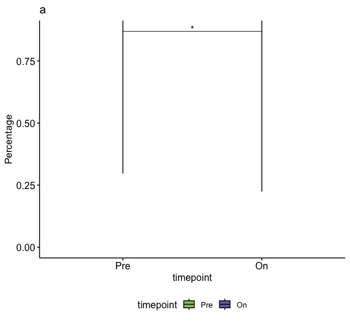


    [[2]]

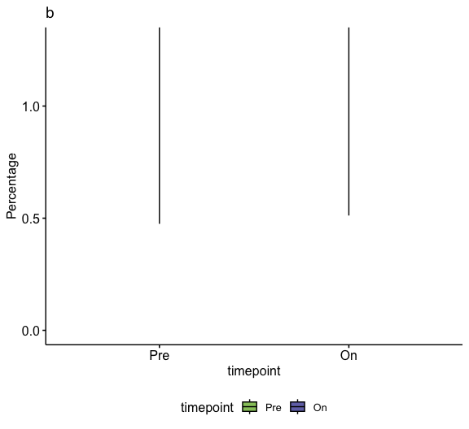


    [[3]]

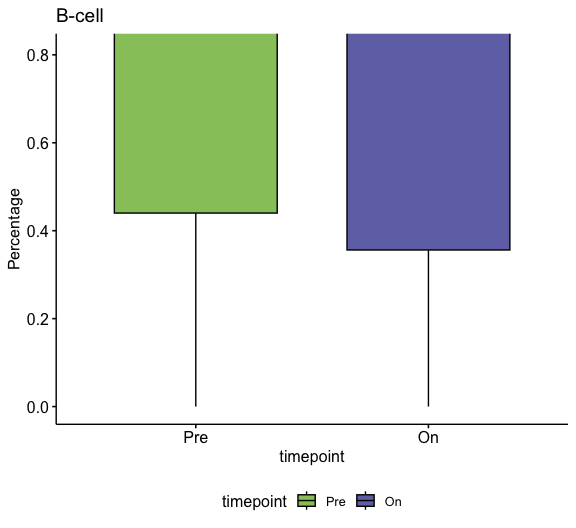


    [[4]]

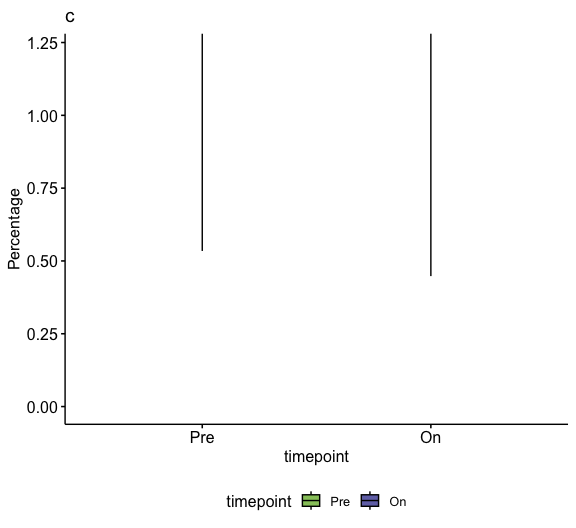


    [[5]]

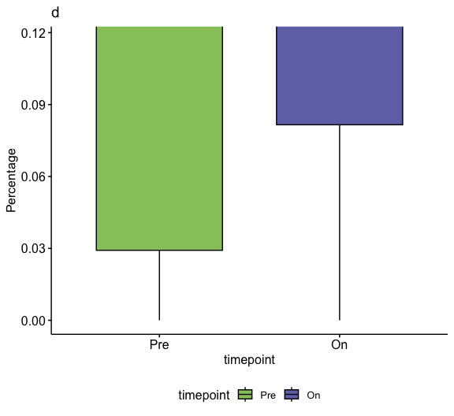


    [[6]]

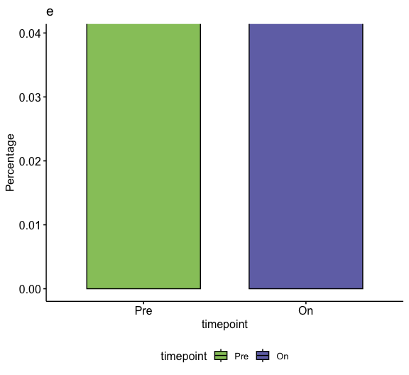


    [[7]]

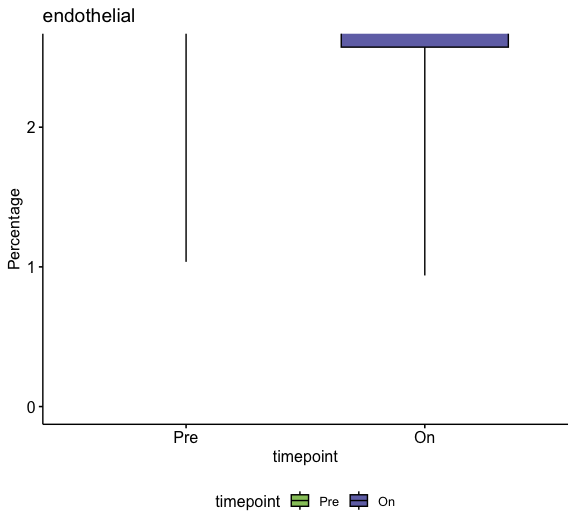


    [[8]]

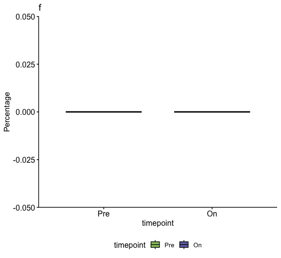


    [[9]]

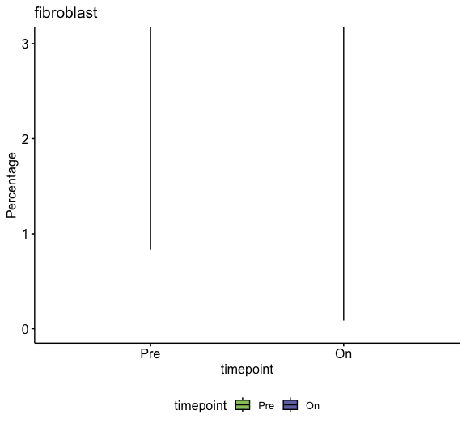


    [[10]]

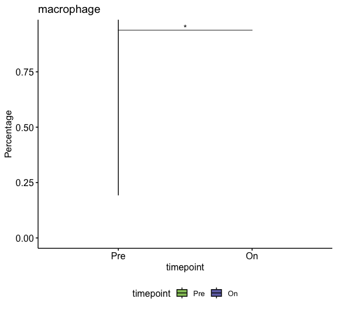


    [[11]]

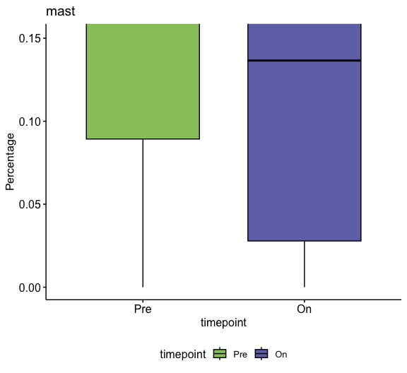


    [[12]]

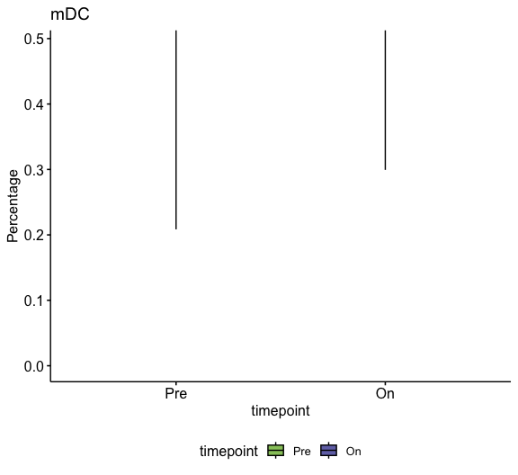


    [[13]]

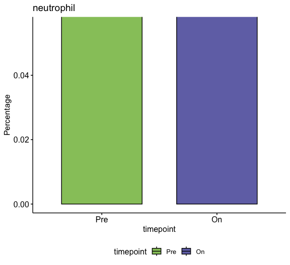


    [[14]]

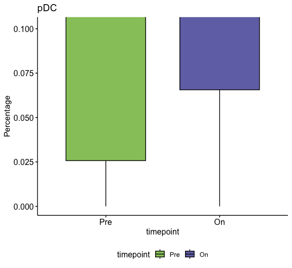


    [[15]]


    [[16]]

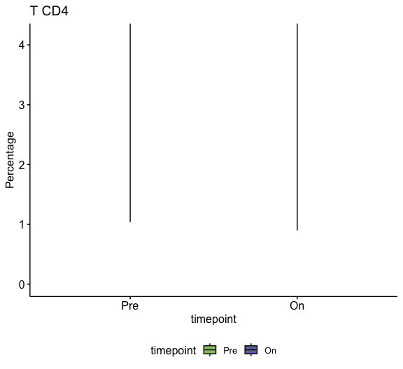


    [[17]]

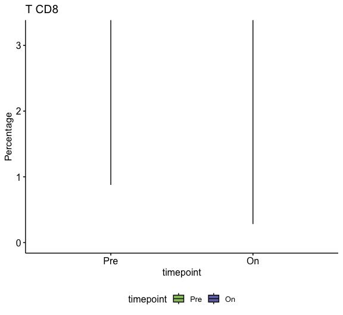


    [[18]]

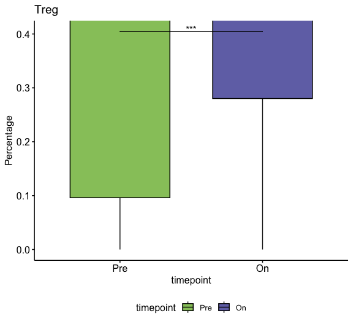

## Subtypes

``` r
lvl.sub <- levels(freqs_sub_all$Var1)
lvl.sub <- lvl.sub[grep("_",lvl.sub)]

pvals.sub <- lapply(lvl.sub, function(i){
  fma <- freqs_sub_all[freqs_sub_all$Var1 %in% i,]
  
  # Pre / on within E /NE
  fma.sub <- fma
  if(sum(fma.sub$Percentage) == 0) return()
  fit <- rstatix::wilcox_test(data = fma.sub, formula = Percentage~timepoint, p.adjust.method = "none", paired = TRUE)
  fit
  

  
  
  
  if(is.null(fit)) return()
  fit$CellType <- i
  fit
}) %>% do.call(what=rbind)

rio::export(pvals.sub, file="./003_Figures/Bassez_noSplit_significant_subsets.xlsx")
```

``` r
library(patchwork)

getPlot <-function(ct.in){
  cts <- freqs_sub_all$Var1[grep(paste0(ct.in,"_"), freqs_sub_all$Var1)] %>% as.character() %>% unique()
  
  cts.o <- paste0(ct.in,"_", 0:20)
  cts.o <- cts.o[cts.o %in% cts]
  
  lapply(cts.o, function(CT){
    fma <- freqs_sub_all[freqs_sub_all$Var1 %in% CT,]
  
    # Create a box plot
    bxp <- ggboxplot(outlier.shape=NA,
      fma, x = "timepoint", y = "Percentage",
      fill = "timepoint", palette = c("#96C66A", "#7172B4")
      )
    
    pvals.sub.sub <- pvals.sub[pvals.sub$CellType %in% CT,]
  
    # Identify outliers
    bp <- boxplot(fma$Percentage, plot=F) 
    if(length(bp$out) > 0){outlier <- which(fma$Percentage %in% bp$out) # get the position of those outliers in your data
    
    maxv <- by(fma[-outlier,]$Percentage, fma[-outlier,]$timepoint, function(i){quantile(i, probs=0.99)}) %>% as.list() %>% do.call(what=c) %>% max(na.rm=T)
    }else{
    maxv <- by(fma$Percentage, fma$timepoint, function(i){quantile(i, probs=0.99)}) %>% as.list() %>% do.call(what=c) %>% max(na.rm=T)
     
    }
    
    seqx <- 1+(0.1*c(1,3,5,7,9,11))
    
    pvals.sub.sub$y.position <- (maxv)*seqx[1:nrow(pvals.sub.sub)]
    seqx <- seqx[-(1:nrow(pvals.sub.sub))]
    pvals.sub.sub$y.position <- (maxv)*seqx[1:nrow(pvals.sub.sub)]
  
    
    pvals.sub.sub <- add_significance(pvals.sub.sub)
  
    if(nrow(pvals.sub.sub) >= 1){
        maxx <- max(pvals.sub.sub$y.position)
    }else{
      maxx <- maxv
    }
    pvals.sub.sub$x <- 1.5
    pvals.sub.sub$xmin <- 1
    pvals.sub.sub$xmax <- 2
    pvals.sub.sub <- pvals.sub.sub[pvals.sub.sub$p <= 0.05,]
    bxp <- bxp + coord_cartesian(ylim = c(0, maxx)) +stat_pvalue_manual(
      pvals.sub.sub,  label = "p.signif", tip.length = 0)+
      theme(legend.position = "bottom")+
      ggtitle(CT)
    bxp
}) %>% wrap_plots(ncol=4)

}
```

``` r
getPlot("T CD4")
```

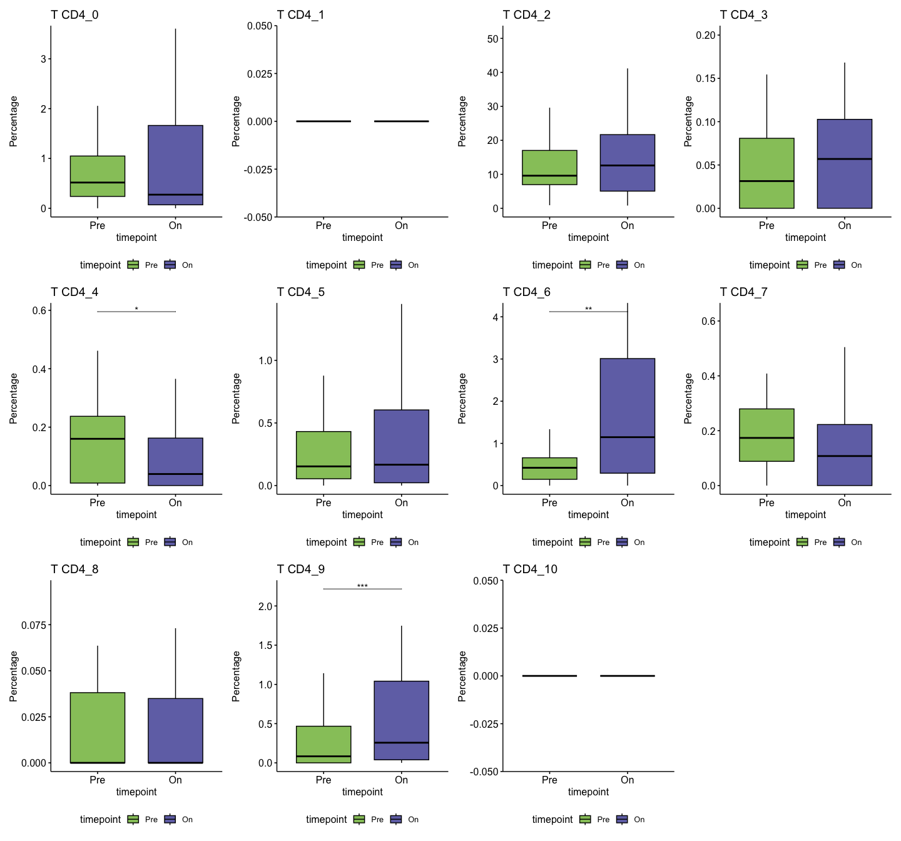

``` r
pdf("./004_PaperFigures/Bassez_noSplit_TCD4.pdf", width=15, height=14)
getPlot("T CD4")
dev.off()
```

    quartz_off_screen 
                    2 

``` r
getPlot("T CD8")
```

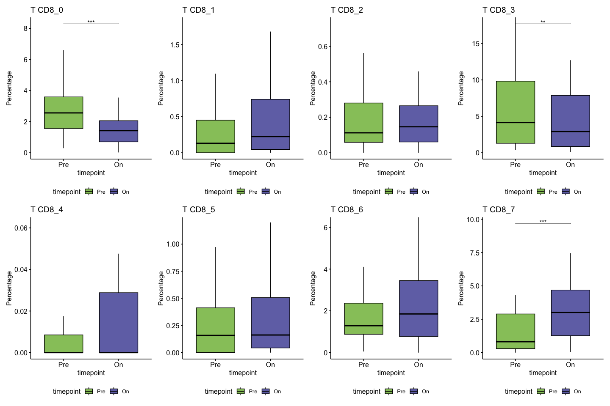

``` r
pdf("./004_PaperFigures/Bassez_noSplit_TCD8.pdf", width=15, height=10)
getPlot("T CD8")
dev.off()
```

    quartz_off_screen 
                    2 

``` r
getPlot("Treg")
```

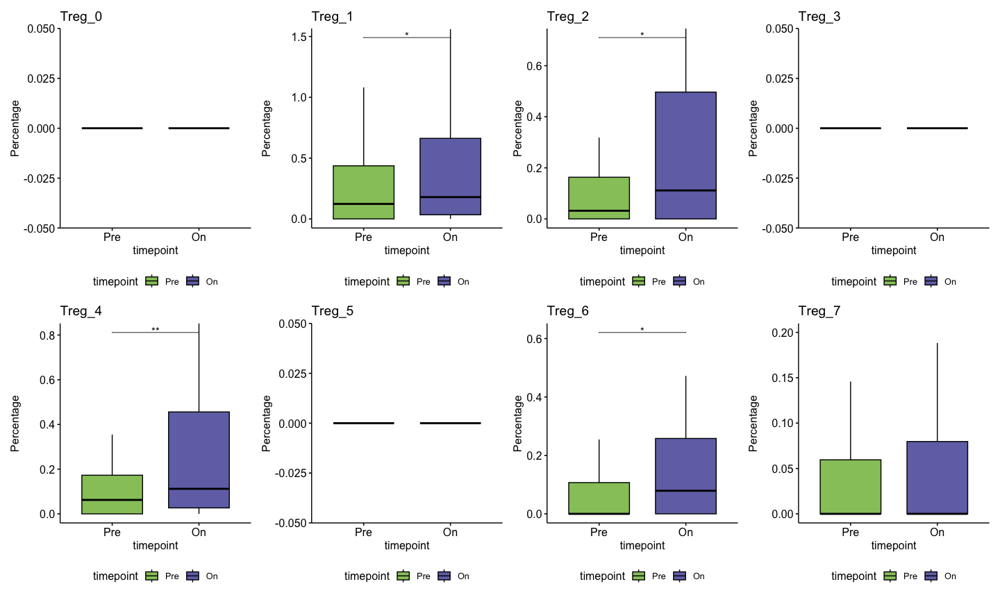

``` r
pdf("./004_PaperFigures/Bassez_noSplit_Treg.pdf", width=15, height=9)
getPlot("Treg")
dev.off()
```

    quartz_off_screen 
                    2 

``` r
getPlot("B-cell")
```

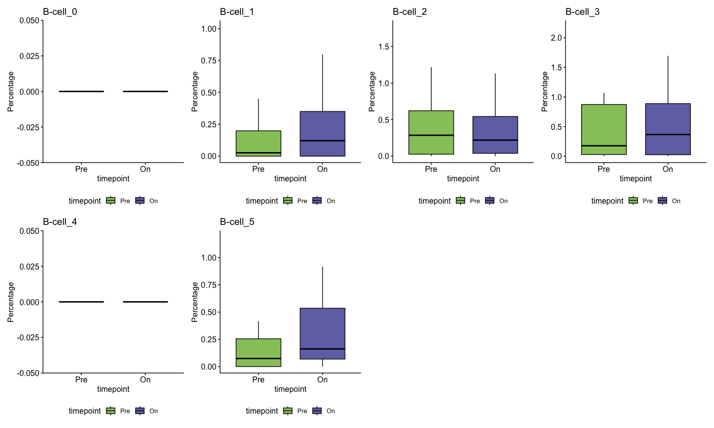

``` r
pdf("./004_PaperFigures/Bassez_noSplit_Bcell.pdf", width=15, height=9)
getPlot("B-cell")
dev.off()
```

    quartz_off_screen 
                    2 

``` r
getPlot("endothelial")
```

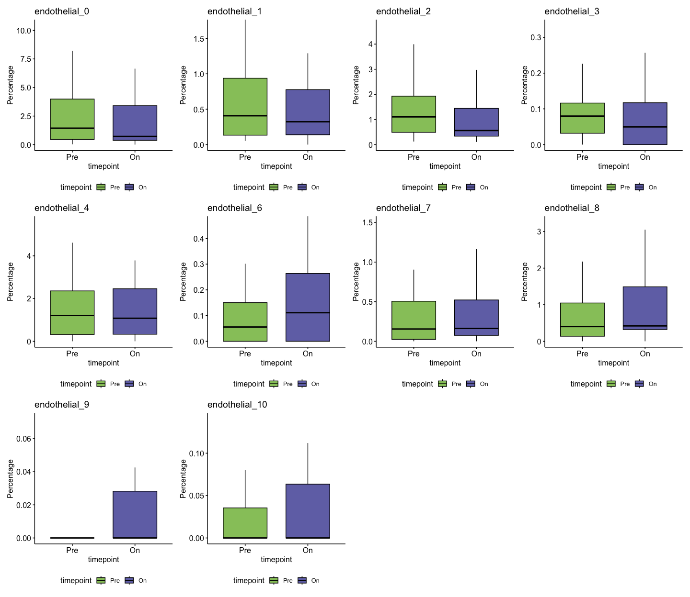

``` r
pdf("./004_PaperFigures/Bassez_noSplit_endothelial.pdf", width=15, height=13)
getPlot("endothelial")
dev.off()
```

    quartz_off_screen 
                    2 

``` r
getPlot("fibroblast")
```

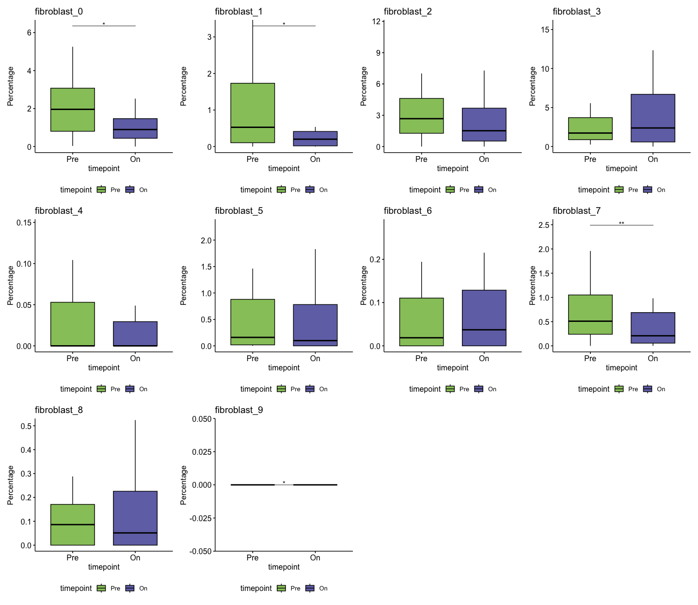

``` r
pdf("./004_PaperFigures/Bassez_noSplit_fibroblast.pdf", width=15, height=13)
getPlot("fibroblast")
dev.off()
```

    quartz_off_screen 
                    2 

``` r
getPlot("macrophage")
```

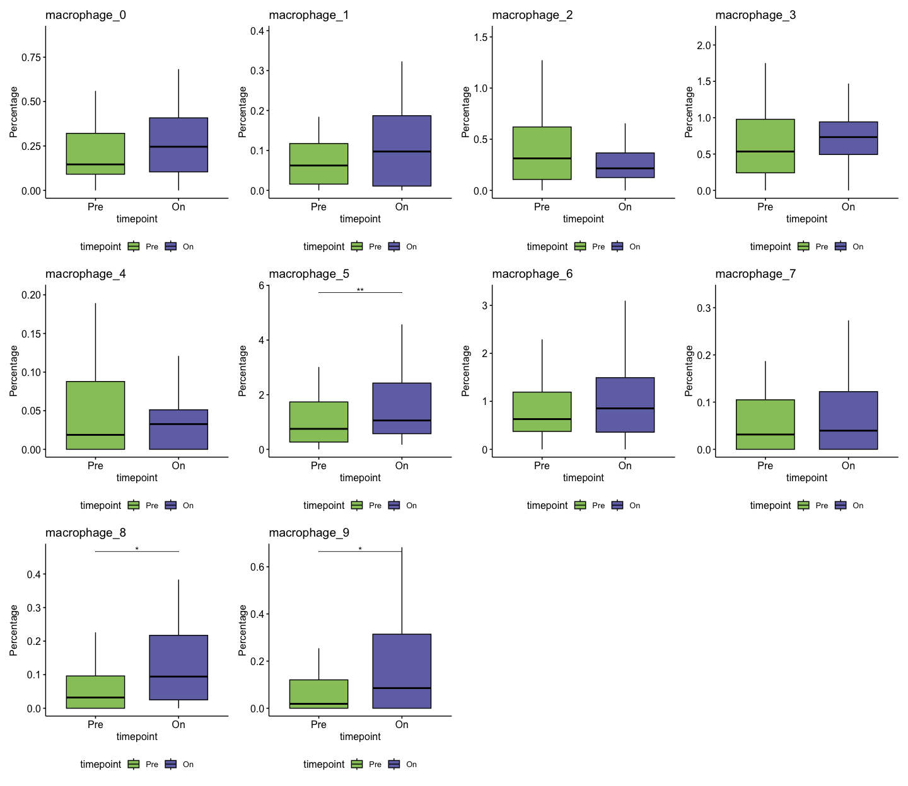

``` r
pdf("./004_PaperFigures/Bassez_noSplit_macrophage.pdf", width=15, height=13)
getPlot("macrophage")
dev.off()
```

    quartz_off_screen 
                    2 

``` r
getPlot("mast")
```

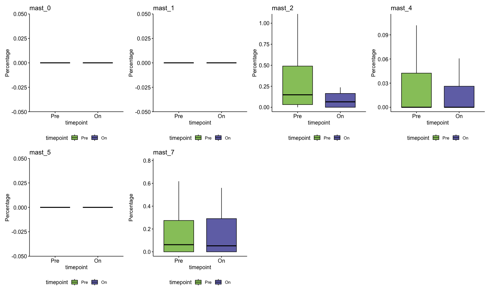

``` r
pdf("./004_PaperFigures/Bassez_noSplit_mast.pdf", width=15, height=9)
getPlot("mast")
dev.off()
```

    quartz_off_screen 
                    2 

``` r
getPlot("mDC")
```

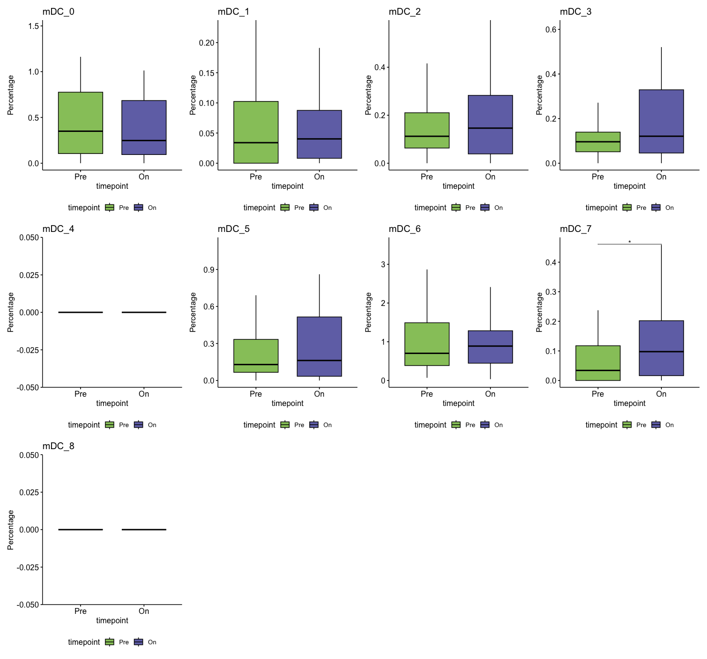

``` r
pdf("./004_PaperFigures/Bassez_noSplit_mDC.pdf", width=15, height=14)
getPlot("mDC")
dev.off()
```

    quartz_off_screen 
                    2 

``` r
getPlot("pDC")
```

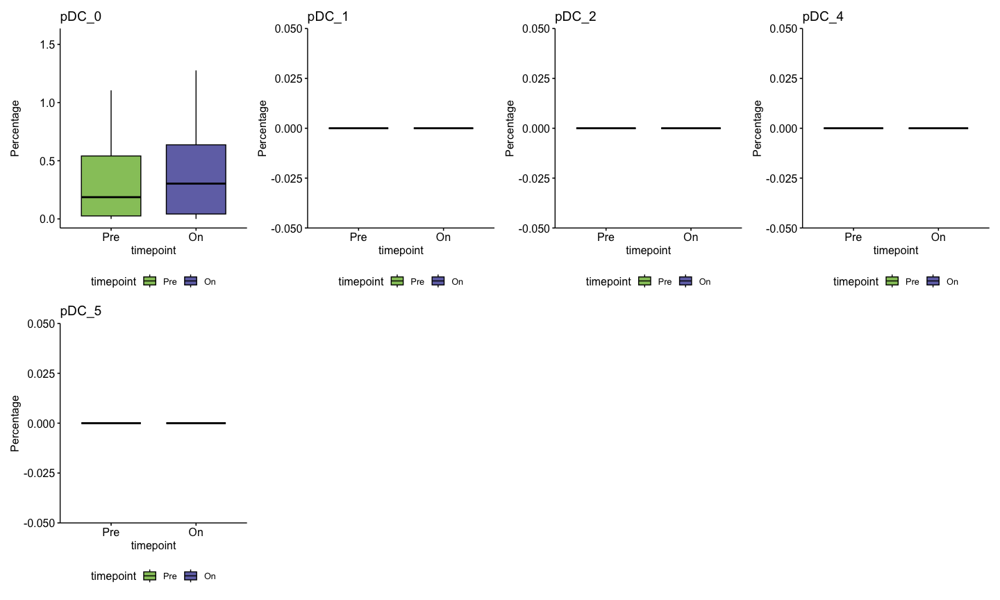

``` r
pdf("./004_PaperFigures/Bassez_noSplit_pDC.pdf", width=15, height=9)
getPlot("pDC")
dev.off()
```

    quartz_off_screen 
                    2 

``` r
getPlot("plasma cell")
```

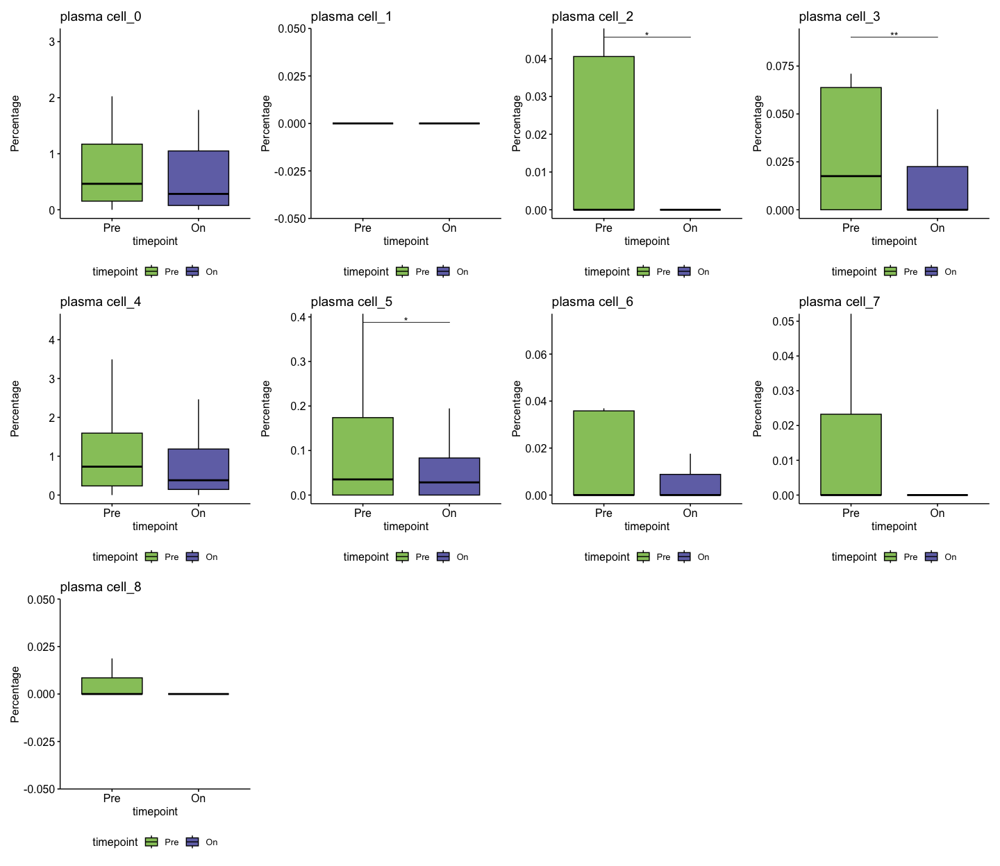

``` r
pdf("./004_PaperFigures/Bassez_noSplit_plasmacell.pdf", width=15, height=13)
getPlot("plasma cell")
dev.off()
```

    quartz_off_screen 
                    2 

``` r
getPlot("neutrophil")
```

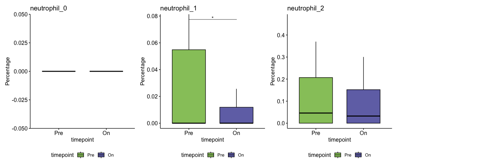

``` r
pdf("./004_PaperFigures/Bassez_noSplit_neutrophil.pdf", width=15, height=5)
getPlot("neutrophil")
dev.off()
```

    quartz_off_screen 
                    2 
