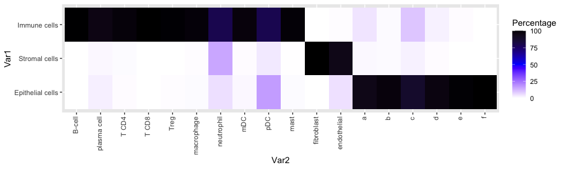

# Signature data Kong


-   [Apply signatures](#apply-signatures)

``` r
dir <- "/Users/rcslieker/Documents/ONCO/002_Projects/002_CosMx_signatures/"
knitr::opts_knit$set(root.dir = dir)
setwd(dir)
```

### Apply signatures

``` r
library(ggplot2)
library(magrittr)
library(Seurat)
```

    Loading required package: SeuratObject

    Loading required package: sp


    Attaching package: 'SeuratObject'

    The following objects are masked from 'package:base':

        intersect, t

``` r
library(ggplot2)
library(ggpubr)
source("~/Documents/ONCO/002_Projects/002_CosMx_signatures/001_Scripts/Utils.R")
```

``` r
load("../000_Data/002_Public_Datasets/Kong_CD/SCP1884/Kong_Data.RData")
cd <- JoinLayers(cd)
save(cd, file = "../000_Data/002_Public_Datasets/Kong_CD/SCP1884/Kong_Data.RData")
```

``` r
load("../000_Data/002_Public_Datasets/Kong_CD/SCP1884/Kong_Data.RData")
cd <- NormalizeData(cd)
```

``` r
load("./002_Data/Kong_Applied.RData")
#Kong_applied <- Kong_applied[!Kong_applied$mainClass %in% tolower(LETTERS[1:6]),]
```

``` r
Kong_applied$mainClass <- gsub("plasmablast","plasma cell",Kong_applied$mainClass)
Kong_applied$subClass <- gsub("plasmablast","plasma cell",Kong_applied$subClass)
Kong_applied <- Kong_applied[!Kong_applied$mainClass %in% "Unassigned",]
```

``` r
freq <- table(Kong_applied$mainClass, Kong_applied$anno_overall) %>% t() %>% as.data.frame()
freq.all <- table(Kong_applied$mainClass) %>% as.data.frame()
freq$Total <- freq.all[match(freq$Var2, freq.all$Var1),2]
freq$Percentage <- (freq$Freq / freq$Total)*100

lvl <- c("B-cell","plasma cell","T CD4","T CD8","Treg","macrophage","neutrophil","mDC","pDC","mast", "fibroblast","endothelial","a","b","c","d","e","f")
freq$Var2 <- factor(freq$Var2, levels=lvl)
freq$Var1 <- factor(freq$Var1, levels=rev(c("Immune cells","Stromal cells","Epithelial cells")))

ggplot(freq, aes(x=Var2, y=Var1, fill=Percentage))+
  geom_tile()+
  theme(axis.text.x=element_text(angle=90, vjust=0.3, hjust=1))+
  scale_fill_gradientn(colors = c("white","blue","black"))
```



``` r
pdf("./003_Figures/Kong_Comparison_cellTypes.pdf", height=5, width=5)
ggplot(freq, aes(x=Var2, y=Var1, fill=Percentage))+
  geom_tile()+
  theme(axis.text.x=element_text(angle=90, vjust=0.3, hjust=1))+
  scale_fill_gradientn(colors = c("white","blue","black"), limits=c(0,100))+
  xlab("Cell types in the current study")+
  ylab("Cell types in Kong et al.")
dev.off()
```

    quartz_off_screen 
                    2 
