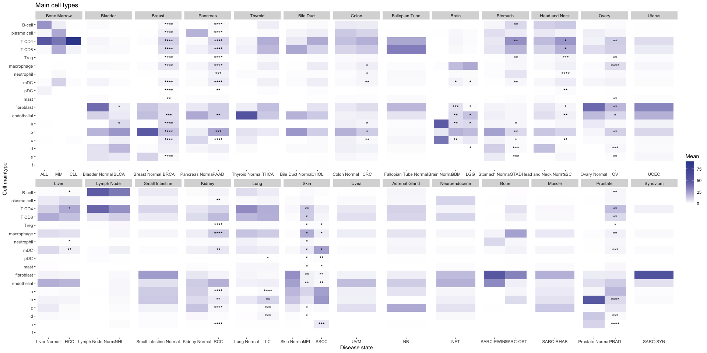
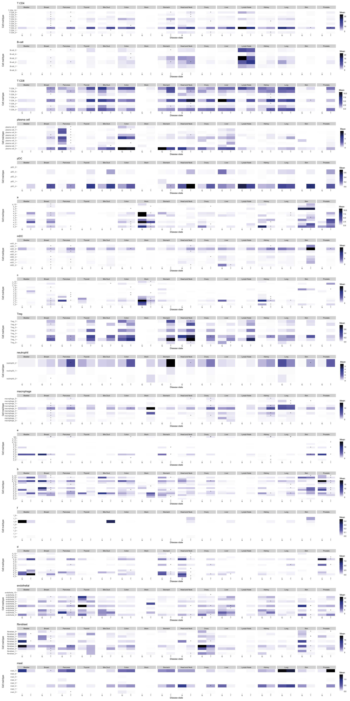

# Junho multiple cancers


-   [Apply signatures](#apply-signatures)
-   [](#section)
    -   [Filter freq](#filter-freq)

``` r
dir <- "/Users/rcslieker/Documents/ONCO/002_Projects/002_CosMx_signatures/"
knitr::opts_knit$set(root.dir = dir)
setwd(dir)
```

### Apply signatures

``` r
library(ggplot2)
library(magrittr)
library(Seurat)
```

    Loading required package: SeuratObject

    Loading required package: sp


    Attaching package: 'SeuratObject'

    The following objects are masked from 'package:base':

        intersect, t

``` r
library(ggplot2)
library(patchwork)
```

# 

``` r
load("../000_Data/002_Public_Datasets/Junho/MetaDataJunho.RData")
```

``` r
allData$predicted_labels <- allData.meta[match(rownames(allData), allData.meta$V1),2]
```

``` r
allData$mainClass <- gsub("plasmablast","plasma cell",allData$mainClass)
allData$subClass <- gsub("plasmablast","plasma cell",allData$subClass)
```

``` r
freq <- table(allData$mainClass, allData$Celltype) %>% t() %>% as.data.frame()
freq.all <- table(allData$mainClass) %>% as.data.frame()
freq$Total <- freq.all[match(freq$Var2, freq.all$Var1),2]
freq$Percentage <- (freq$Freq / freq$Total)*100
```

``` r
freq <- freq[!freq$Var2 %in% "Unassigned",]
lvl <- c("B-cell","plasma cell","T CD4","T CD8","Treg","macrophage","neutrophil","mDC","pDC","mast", "fibroblast","endothelial","a","b","c","d","e","f")
freq$Var2 <- factor(freq$Var2, levels=lvl)

freq$Var1 <- factor(freq$Var1, levels=rev(c("B cell","Plasma cell","T cell","NK cell","Macrophage","Dendritic cell","pDC","Mast","Fibroblast","Endothelial","Epithelial")))
```

``` r
ggplot(freq, aes(x=Var2, y=Var1, fill=Percentage))+
  geom_tile()+
  theme(axis.text.x=element_text(angle=90, vjust=0.3, hjust=1))+
  scale_fill_gradientn(colors = c("white","blue","black"))
```


``` r
pdf("./003_Figures/Kang_Comparison_cellTypes.pdf", height=5, width=5)
ggplot(freq, aes(x=Var2, y=Var1, fill=Percentage))+
  geom_tile()+
  theme(axis.text.x=element_text(angle=90, vjust=0.3, hjust=1))+
  scale_fill_gradientn(colors = c("white","blue","black"), limits=c(0,100))+
  xlab("Cell types in the current study")+
  ylab("Cell types in Kang et al.")
dev.off()
```

    quartz_off_screen 
                    2 

``` r
freq <- table(allData$subClass, allData$predicted_labels) %>% t() %>% as.data.frame()
freq$mainClass <- reshape2::colsplit(freq$Var2,"_", LETTERS[1:2])[,1]
freq <- freq[!freq$mainClass %in% tolower(LETTERS[1:6]),]
freq.all <- table(allData$subClass) %>% as.data.frame()
freq$Total <- freq.all[match(freq$Var2, freq.all$Var1),2]
freq$Percentage <- (freq$Freq / freq$Total)*100

dx <- reshape2::dcast(freq, formula = Var2~Var1, value.var="Percentage")
rownames(dx) <- dx[,1]
dx <- dx[,-1]

order <- dx %>% t() %>% dist() %>% hclust() %>% as.dendrogram() %>% labels()

freq$Var1 <- factor(freq$Var1, levels = order)

lvl.sub <- paste0(rep(unique(freq$mainClass),each=21),"_", 0:20)
lvl.sub <-lvl.sub[lvl.sub %in% freq$Var2]
freq$Var2 <- factor(freq$Var2,lvl.sub)
freq$mainClass <- factor(freq$mainClass,lvl)
```

## Filter freq

``` r
cutoff <- 5 #1%
vars <- freq[freq$Percentage > cutoff,1] %>% unique()
freq.sub <- freq[freq$Var1 %in% vars,]
```

``` r
ggplot(freq.sub, aes(x=Var2, y=Var1, fill=Percentage, label=Freq))+
  geom_tile()+
  theme(axis.text.x=element_text(angle=90, vjust=0.3, hjust=1))+
  scale_fill_gradientn(colors = c("white","blue","black"))+
  facet_grid(~mainClass, scale="free", space="free")+
  xlab("Cell type current study")+
  ylab("Cell type Kang data based on celltypist")
```


``` r
pdf("./003_Figures/Junho_CellTypist.pdf", width=20, height=7)
ggplot(freq.sub, aes(x=Var2, y=Var1, fill=Percentage, label=Freq))+
  geom_tile()+
  theme(axis.text.x=element_text(angle=90, vjust=0.3, hjust=1))+
  scale_fill_gradientn(colors = c("white","blue","black"))+
  facet_grid(~mainClass, scale="free", space="free")+
  xlab("Cell type current study")+
  ylab("Cell type Kang data based on celltypist")
dev.off()
```

    quartz_off_screen 
                    2 

``` r
freqs_main <- table(allData$mainClass, allData$Patient) %>% reshape2::melt()
freqs_sub <- table(allData$subClass, allData$Patient) %>% reshape2::melt()
main.all <- table(allData$Patient)
sub.all <- table(allData$Patient)

freqs_main$Total <- main.all[match(freqs_main$Var2, names(main.all))]
freqs_sub$Total <- sub.all[match(freqs_sub$Var2, names(sub.all))]

freqs_main$Percentage <- as.numeric((freqs_main$value / freqs_main$Total)*100)
freqs_sub$Percentage <- as.numeric((freqs_sub$value / freqs_sub$Total)*100)

freqs_main$Tissue <- allData[match(freqs_main$Var2, allData$patient_ID),"tissue"]
freqs_main$Disease <- allData[match(freqs_main$Var2, allData$patient_ID),"disease"]

freqs_main$Tissue <- allData[match(freqs_main$Var2, allData$Patient),"Tissue"]
freqs_main$Disease <- allData[match(freqs_main$Var2, allData$Patient),"Cancer.type"]
freqs_main$Organ_origin <- allData[match(freqs_main$Var2, allData$Patient),"Organ_origin"]

freqs_sub$Tissue <- allData[match(freqs_sub$Var2, allData$Patient),"Tissue"]
freqs_sub$Disease <- allData[match(freqs_sub$Var2, allData$Patient),"Cancer.type"]
freqs_sub$Organ_origin <- allData[match(freqs_sub$Var2, allData$Patient),"Organ_origin"]
```

``` r
freqs_main <- freqs_main[!freqs_main$Tissue %in% "Metaplasia",]
freqs_sub <- freqs_sub[!freqs_sub$Tissue %in% "Metaplasia",]
```

``` r
all.main.P <- lapply(unique(as.character(freqs_main$Var1)), function(cts){
  #cat(cts)
  fts <- freqs_main[freqs_main$Var1 %in% cts,]
  res.out <- lapply(unique(fts$Organ_origin), function(dx){
    #cat(dx)
    fts.dx <- fts[fts$Organ_origin %in% dx,]
    if(length(unique(fts.dx$Tissue)) <= 1) return()
    if(sum(fts.dx$Percentage) == 0) return()
      
    ref <- fts.dx[fts.dx$Tissue %in% "Normal","Disease"] %>% unique() %>% as.character()
    
    check <- by(fts.dx$Percentage, as.character(fts.dx$Disease), sum) %>% as.list() %>% do.call(what=c)
    check <- check[-grep("Normal", names(check))]
    check <- check[!check == 0]
    
    fts.dx <- fts.dx[fts.dx$Disease %in% c(ref, names(check)),]
    if(length(check) == 0) return()
    
    if(length(ref) > 1) stop("Error!")
    cx <- fts.dx[!fts.dx$Tissue %in% "Normal","Disease"] %>% unique() %>% as.character()
    
    comp <- lapply(cx, function(i){
      c(ref, i)
    })
    
    fit <- rstatix::pairwise_wilcox_test(data = fts.dx, formula = Percentage~Disease, comparisons = comp, ref.group = ref) %>% as.data.frame()
    fit$Tissue <- dx
    fit
  }) %>% do.call(what=rbind)
  res.out$CellType <- cts
  res.out
}) %>% do.call(what=rbind)
```

``` r
all.main.P$Label <- ifelse(all.main.P$p <= 0.05,"*", NA)


library(dplyr)
```


    Attaching package: 'dplyr'

    The following objects are masked from 'package:stats':

        filter, lag

    The following objects are masked from 'package:base':

        intersect, setdiff, setequal, union

``` r
fsa.m <- freqs_main %>% 
  group_by(Var1, Disease, Organ_origin) %>%
  summarise(Mean = mean(Percentage))
```

    `summarise()` has grouped output by 'Var1', 'Disease'. You can override using
    the `.groups` argument.

``` r
fsa.m$newID <- paste0(fsa.m$Var1, "_", fsa.m$Disease)

all.main.P$newID <- paste0(all.main.P$CellType,"_",all.main.P$group2)

fsa.m$Sign <- ifelse(all.main.P[match(fsa.m$newID, all.main.P$newID),"p",drop=T] <= 0.05,"*","")
fsa.m$Sign[is.na(fsa.m$Sign)] <- ""
#fsa.m$Tissue <- factor(fsa.m$Tissue, levels=c("Normal","Tumor"))
```

``` r
lvl <- c("B-cell","plasma cell","T CD4","T CD8","Treg","macrophage","neutrophil","mDC","pDC","mast", "fibroblast","endothelial","a","b","c","d","e","f")
fsa.m <- fsa.m[!fsa.m$Var1 %in% "Unassigned",]
fsa.m$Var1 <- factor(fsa.m$Var1, levels=rev(lvl))

lvl2 <- unique(c(fsa.m$Disease[grep("Normal", fsa.m$Disease)],fsa.m$Disease[-grep("Normal", fsa.m$Disease)]))
fsa.m$Disease <- factor(fsa.m$Disease, levels=lvl2)
#df <- table(fsa.m$Organ_origin, fsa.m$Tissue) %>% as.data.frame()
#remove <- df[df$Freq ==0,1]
#fsa.m <- fsa.m[!fsa.m$Var1 %in% "Unassigned" & !fsa.m$Organ_origin %in% remove,]


fsa.m$Sign <- all.main.P[match(fsa.m$newID,all.main.P$newID),"p.adj.signif"]
fsa.m$Sign <- ifelse(fsa.m$Sign %in% "ns","",fsa.m$Sign)
ggplot(fsa.m, aes(x=Disease, y=Var1, fill=Mean, label=Sign))+
  geom_tile()+
  scale_fill_gradientn(colors = c("white","#7172B4","#374999"))+
  facet_wrap(~Organ_origin, scale="free_x", nrow = 2)+
  geom_text(aes(label = Sign))+
  theme(panel.background = element_rect(fill = "white"))+
  xlab("Disease state")+
  ylab("Cell maintype")+
  ggtitle("Main cell types")
```



``` r
all.sub.P <- lapply(unique(as.character(freqs_sub$Var1)), function(cts){
  #cat(cts)
  fts <- freqs_sub[freqs_sub$Var1 %in% cts,]
  res.out <- lapply(unique(fts$Organ_origin), function(dx){
    #cat(dx)
    fts.dx <- fts[fts$Organ_origin %in% dx,]
    if(length(unique(fts.dx$Tissue)) <= 1) return()
    if(sum(fts.dx$Percentage) == 0) return()
      
    ref <- fts.dx[fts.dx$Tissue %in% "Normal","Disease"] %>% unique() %>% as.character()
    
    check <- by(fts.dx$Percentage, as.character(fts.dx$Disease), sum) %>% as.list() %>% do.call(what=c)
    check <- check[-grep("Normal", names(check))]
    check <- check[!check == 0]
    
    fts.dx <- fts.dx[fts.dx$Disease %in% c(ref, names(check)),]
    if(length(check) == 0) return()
    
    if(length(ref) > 1) stop("Error!")
    cx <- fts.dx[!fts.dx$Tissue %in% "Normal","Disease"] %>% unique() %>% as.character()
    
    comp <- lapply(cx, function(i){
      c(ref, i)
    })
    
    fit <- rstatix::pairwise_wilcox_test(data = fts.dx, formula = Percentage~Disease, comparisons = comp, ref.group = ref) %>% as.data.frame()
    fit$Tissue <- dx
    fit
  }) %>% do.call(what=rbind)
  res.out$CellType <- cts
  res.out
}) %>% do.call(what=rbind)
```

``` r
px <- lapply(unique(allData[!allData$mainClass %in% "Unassigned",]$mainClass), function(ct){
  fsa <- freqs_sub[grep(paste0(ct,"_"),freqs_sub$Var1),]
  
  tx <- fsa[fsa$Tissue %in% "Tumor","Organ_origin"] %>% unique()
  tx2 <- fsa[fsa$Tissue %in% "Normal","Organ_origin"] %>% unique()
  isx <- intersect(tx, tx2)
  fsa <- fsa[fsa$Organ_origin %in% isx,] 
    
  fsa.m <- fsa %>% 
    group_by(Var1, Disease, Organ_origin) %>%
    summarise(Mean = mean(Percentage))
  fsa.m$newID <- paste0(fsa.m$Var1, "_", fsa.m$Disease)

    
  all.sub.P$newID <- paste0(all.sub.P$CellType,"_",all.sub.P$group2)
  
  fsa.m$Sign <- all.sub.P[match(fsa.m$newID, all.sub.P$newID),"p.adj.signif",drop=T]
  fsa.m$Sign <- ifelse(fsa.m$Sign == "ns",NA,fsa.m$Sign)
  
  
  
  
  lvl <- paste0(ct,"_", 0:20)
  lvl <-lvl[lvl %in% fsa.m$Var1]
  
  
  fsa.m$Sign <- ifelse(all.sub.P[match(fsa.m$newID, all.sub.P$newID),"p",drop=T] <= (0.05/length(lvl)),"*","")
  fsa.m$Sign[is.na(fsa.m$Sign)] <- ""
  
  
  fsa.m$Var1 <- factor(as.character(fsa.m$Var1), levels=lvl)
  
    
  lvl2 <- unique(c(fsa.m$Disease[grep("Normal", fsa.m$Disease)],fsa.m$Disease[-grep("Normal", fsa.m$Disease)]))
  fsa.m$Disease <- factor(fsa.m$Disease, levels=lvl2)
  
  
  fsa.m <- fsa.m[!fsa.m$Var1 %in% "Unassigned",]
  
  fsa.m$newName <- "T"
  fsa.m$newName[grep("Normal",fsa.m$Disease)] <- "N"
  
  ggplot(fsa.m, aes(x=newName, y=Var1, fill=Mean, label=Sign))+
    geom_tile()+
    scale_fill_gradientn(colors = c("white","#7172B4","#374999","black"))+
    facet_grid(~Organ_origin, scale="free_x")+
    geom_text()+
    theme(panel.background = element_rect(fill = "white"))+
    xlab("Disease state")+
    ylab("Cell maintype")+
    ggtitle(ct)

  
}) %>% wrap_plots(ncol = 1)
```

    `summarise()` has grouped output by 'Var1', 'Disease'. You can override using
    the `.groups` argument.
    `summarise()` has grouped output by 'Var1', 'Disease'. You can override using
    the `.groups` argument.
    `summarise()` has grouped output by 'Var1', 'Disease'. You can override using
    the `.groups` argument.
    `summarise()` has grouped output by 'Var1', 'Disease'. You can override using
    the `.groups` argument.
    `summarise()` has grouped output by 'Var1', 'Disease'. You can override using
    the `.groups` argument.
    `summarise()` has grouped output by 'Var1', 'Disease'. You can override using
    the `.groups` argument.
    `summarise()` has grouped output by 'Var1', 'Disease'. You can override using
    the `.groups` argument.
    `summarise()` has grouped output by 'Var1', 'Disease'. You can override using
    the `.groups` argument.
    `summarise()` has grouped output by 'Var1', 'Disease'. You can override using
    the `.groups` argument.
    `summarise()` has grouped output by 'Var1', 'Disease'. You can override using
    the `.groups` argument.
    `summarise()` has grouped output by 'Var1', 'Disease'. You can override using
    the `.groups` argument.
    `summarise()` has grouped output by 'Var1', 'Disease'. You can override using
    the `.groups` argument.
    `summarise()` has grouped output by 'Var1', 'Disease'. You can override using
    the `.groups` argument.
    `summarise()` has grouped output by 'Var1', 'Disease'. You can override using
    the `.groups` argument.
    `summarise()` has grouped output by 'Var1', 'Disease'. You can override using
    the `.groups` argument.
    `summarise()` has grouped output by 'Var1', 'Disease'. You can override using
    the `.groups` argument.
    `summarise()` has grouped output by 'Var1', 'Disease'. You can override using
    the `.groups` argument.
    `summarise()` has grouped output by 'Var1', 'Disease'. You can override using
    the `.groups` argument.

``` r
print(px)
```



``` r
pdf("./004_PaperFigures/Junho_NormalTumor_cellTypes.pdf", width=25, height=50)
print(px)
dev.off()
```

    quartz_off_screen 
                    2 
